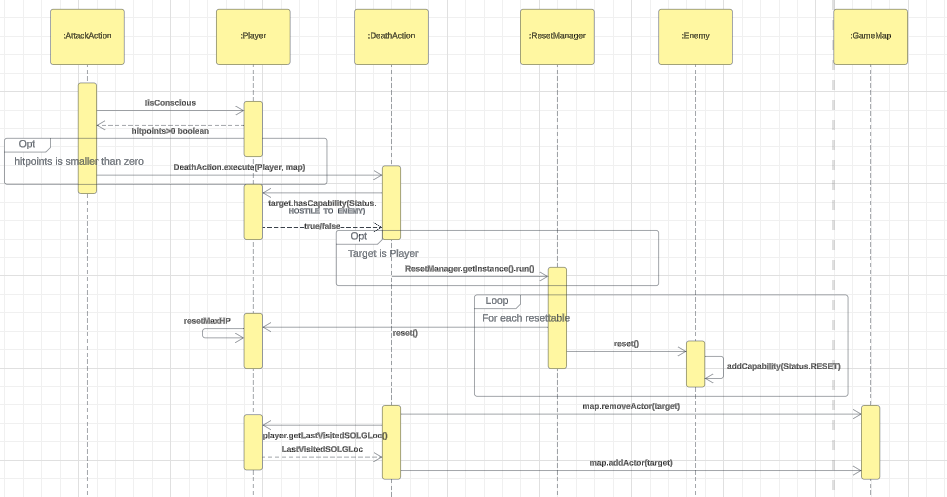

# Text Based Rogue-like Game
## Demo
[]

<iframe width="560" height="315" src="https://www.youtube.com/embed/vfosYZm6eAw?si=p1Iy9gQa4j9Wh5tT" title="YouTube video player" frameborder="0" allow="accelerometer; autoplay; clipboard-write; encrypted-media; gyroscope; picture-in-picture; web-share" allowfullscreen></iframe>
## About the Game
A text based rogue-like game (very loosely based on Elden Ring) written in Java. 

### A. Environments

1. Graveyard n

It is represented as n (lowercase N) and it is occupied by the "Heavy Skeletal Swordsman" creatures. They can be spawned from the graveyard with a 27% chance at each turn.

2. Gust of Wind &

It is represented as  & (ampersand) and it can spawn "Lone Wolf" with a 33% chance at every game turn.

3. Puddle of Water ~

It is represented as ~ (tilde) and it has a 2% chance of spawning a "Giant Crab".

### B. Enemies
One type of enemy could attack the other type. They, however, cannot attack their type, e.g. Lone Wolf can attack a Giant Crab, but Lone Wolf cannot attack another Lone Wolf (except for Giant Crab & Heavy Skeletal Swordsman since their attack damage anything in their surrounding).

If an enemy is close (one block away) to the player, they will follow the player. Otherwise, they will wander around the map. However, suppose an enemy of one type is close to another type of enemy. In that case, they will attack without following them, e.g. if a Giant Crab is close to a Lone Wolf, the Lone Wolf will attack the Giant Crab without following it.

At each turn, Giant Crabs, Lone Wolves and Heavy Skeletal Swordsmen have a 10% chance of being despawned (removed from the map) unless they are following the player.

1. Heavy Skeletal Swordsman q

A hostile creature, represented by q (lowercase Q), that has 153 hit points and carries around a weapon called Grossmesser.

This creature has the following unique ability: it can become a "Pile of Bones" (represented by X (uppercase X)) for three (3) turns if killed by other enemies or the player. If the Pile of Bones is not hit within the three turns, the Heavy Skeletal Swordsman will be revived with full health.

2. Lone Wolf h

A hostile creature, represented by h (lowercase H), that has 102 hit points and bites other creatures, including the player, dealing 97 damage with 95% attack accuracy.

3. Giant Crab C

Another hostile creature, represented by C (uppercase C), that has 407 hit points and slams other creatures, including the player, dealing 208 damage with 90% attack accuracy.

Instead of only attacking one particular enemy in their surroundings, the Giant Crab may also decide to slam all creatures within their surroundings (all 8 locations), dealing the same amount of damage with the same accuracy as their targeted attack.

Note that since their slam area attack hits anything in their surroundings, they may hit other Giant Crabs within the attack area.

Moreover, if a Giant Crab performs the slam area attack, actor A may get hit while actor B may not (the probability is independent between each actor, i.e. one actor getting hit does not mean another actor will also get hit)

### C. Weapons
1. Grossmesser (?)

A curved sword, represented by ? (question mark), carried around by the Heavy Skeletal Swordsman that deals 115 damage with 85% attack accuracy.

This sword allows the user to attack a single enemy within their surroundings or to perform a spinning attack, which attacks all creatures, including the player, within the user’s surroundings. The damage dealt and the attack accuracy for the targeted and the spinning attack is the same.

Note that since the spinning attack hits anything in the user’s surroundings, it may hit other actors of the same type (Heavy Skeletal Swordsman A performing the spinning attack may accidentally hit Heavy Skeletal Swordsman B)

If the user performs the spinning attack, actor A may get hit while actor B may not (the probability is independent between each actor, i.e. one actor getting hit does not mean another actor will also get hit)

Edit: Grossmesser will be dropped by Heavy Skeletal Swordsman when they are defeated by the player (after the pile of bones is destroyed).

D. Trader K
The trader that could be found on the first map is Merchant Kale, represented by K (uppercase K). Merchant Kale sits around the building in the middle of the map. In the current version of the game, Kale cannot move around, and the player cannot attack them.

E. Weapons
Merchant Kale allows the player to purchase the following weapons:

Again, if REQ4 is not mandatory for your group, you should choose one of the following weapons (Uchigatana, Great Knife and Club) to implement the trading functionality. You may decide to implement all of them for developing a complete game, but your marks will not be affected (positively or negatively).

Uchigatana for 5000 runes

Great Knife for 3500 runes

Club for 600 runes

Additionally, if the player carries any of these weapons in their inventory, the player could decide to sell them to Kale for the following price.

Uchigatana for 500 runes

Great Knife for 350 runes

Club for 100 runes

E. Flask of Crimson Tears
In Elden Ring, the enemies' attack s a significant amount of damage, and the player does not have a lot of hit points. To give the player a fighting chance, the player will start the game with an item, the Flask of Crimson Tears. This item can be consumed twice (maximum uses for now), and each time the player uses it, their health will be restored by 250 points. Additionally, the player cannot drop Flask of Crimson Tears.

F. Site of Lost Grace
The Site of Lost Grace is a unique ground in the game of Elden Ring, represented by U (uppercase U). It allows the player to rest on it. When this happens, the entire game will be reset (see the next section for more details on game reset).

G. Game Reset
If you implement this requirement, the death of the player will no longer end the game.

Since the concept of death has been removed from the Lands Between during the event of Elden Ring, nobody can truly die.

To implement this functionality, when the player dies (or if they rest at the site of lost grace), the game will be reset.

When the game is reset, the following happens.

All enemies that can spawn from the grounds will be removed from the map/despawn (including piles of bone - see REQ1: Heavy Skeletal Swordsman's unique ability)

Assume all enemies are resettable, but enemies added in the future version of the game may have different behaviour, i.e. they may not be removed from the map when the game is reset.

The player's hit point will be reset to the maximum

The Flask of Crimson Tears will be reset to the maximum number of uses

Note that dropped weapons can be left on the ground if the world is reset (for instance, if the player killed a Heavy Skeletal Swordsman before the game is reset and the enemy dropped the Grossmesser, the Grossmesser will stay on the ground after the game is reset)

Also, note that when the player dies, their weapons and items will not be dropped.

Edit: when the player dies, they should respawn in the last site of lost grace that they visited.

H. Runes
In relation to runes, the following happens when the player dies.

The following will not happen if the player rest at the site of lost grace.

If the player "dies", their runes will be left on the location just before they died (e.g. if they are starting from (1,1) and then died at (1,2), the runes should appear in (1,1) instead of (1,2))

When the player stands on top of the dropped runes, the player should be given the option to recover the dropped runes, e.g. Tarnished retrieves Runes (value: 0)

If the player died again before grabbing the runes, the runes would disappear. If the player rests at the site of lost grace, the runes will not disappear.

The runes dropped by the player should be represented by $ (the dollar sign).

F. Classes/Combat Archetypes
Before the game begins, the player is be able to choose their starting class (not to be confused with the object-oriented concept of classes).

These classes determine which weapon the player will start the game with and the player's starting hit point.

For the current version of the game, the hit point of the player cannot be upgraded. Upgrading the total amount of hit points of the player, however, may be integrated into the game in the future version. 

In the current version of the game, the following classes are available as options to the player when the game starts.

1. Samurai

If the player chooses the samurai class, they will start the game with Uchigatana as their starting weapon. Their starting hit point will be 455.

2. Bandit

If the player chooses the bandit class, their starting hit point is 414, and they start with the Great Knife in their weapon inventory.

3. Wretch

If the player chooses the Wretch class, they will start with 414 hit points and a Club as their weapon.

## UML Diagrams

## Sequence Diagrams

**Area attack Action**

**Choosing a combat class**

**Merchant Kale**

**Resetting the game**

